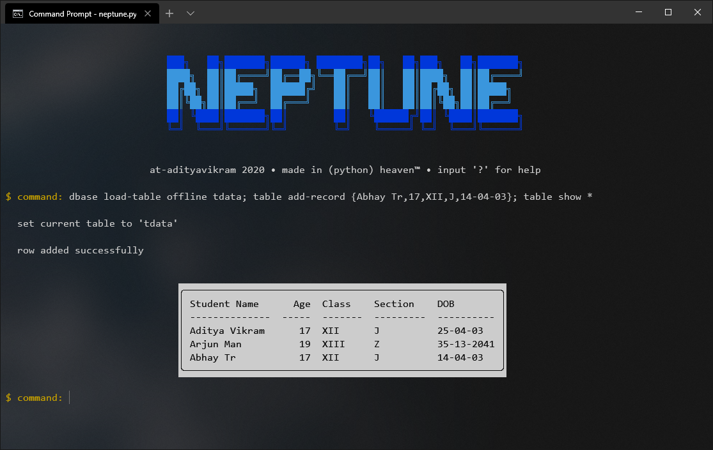

<h1 align="center">𝖓𝖊𝖕𝖙𝖚𝖓𝖊</h1>
<h3 align="center">The second generation of databasic. Now much better. Currently under development, and incomplete.</h3>

<h3>What can you do with this?</h3>
 A lot. It's more colorful, more customizable, offers greater efficiency through the syntax and is easy to learn.
 For testing, you can use the provided tdata.dbc Keep it in the dbase folder, and keep the dbase folder in the same directory as neptune

<h3>Syntax</h3>
 You can have all your commands in a single line (separated by ';', but the last command of the line should not have the ';'
 or you can input them one by one, given which no command should have the ';' at its end.

<h3>Caution</h3>
 To have the colors correctly rendered, you need to have a registry entry in place. If you don't have it already, all you need to do is have the 'enablecolor.reg'
in the same directory as neptune. It will detect this file while openining up and install this for you, apter prompting for permission. You may need to restart neptune afterwards.
 If you already have this entry in place, simply delete the file, so its not executed every time neptune is run.
  
Also, Never run this in the IDLE, it just won't work

<h3>Planned Features</h3>
<ul>
<li> ftp and git support
<li> color personalization
<li> a lot more commands
<li> rich-text help, with images
</ul>

<h3>Requirements</h3> 
tabulate, colorama, enablecolor.reg (one time only)

<h3>Current limitations</h3> 
right now, there re lots, but keep in mind that this first version cannot save the changes yet.
as of this build, the only manipulator is add-record

